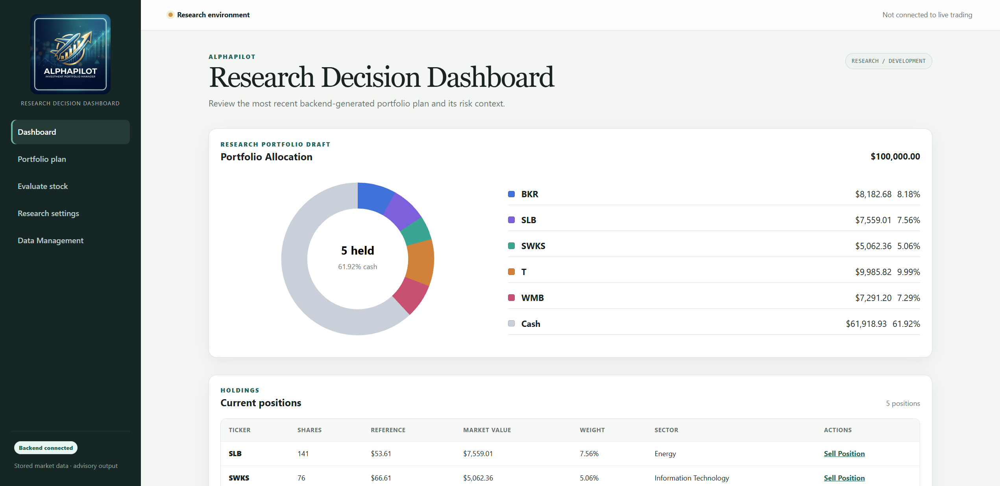
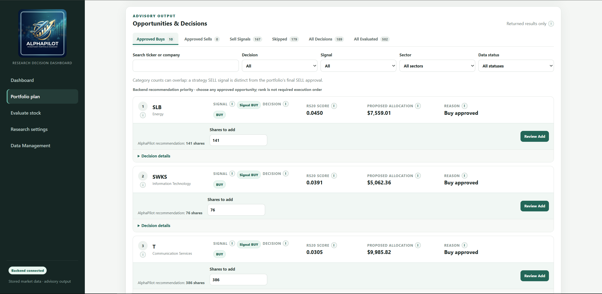
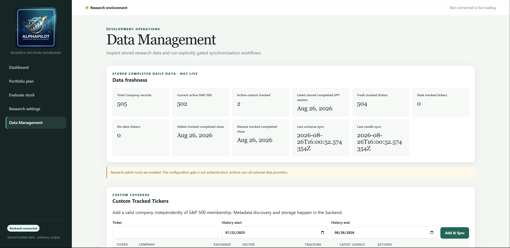
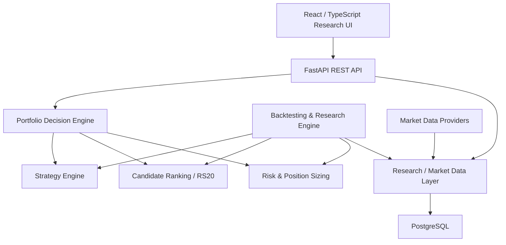

<div align="center">


# AlphaPilot

### Quantitative Trading Research & Portfolio Decision Platform

**Python · FastAPI · PostgreSQL · React · TypeScript · Quantitative Research · AI-Assisted Engineering**

</div>

---

## Overview

**AlphaPilot** is a full-stack quantitative trading research and portfolio decision-support platform for U.S. equities.

The project combines:

- historical market-data pipelines
- deterministic trading strategies
- multi-stock portfolio backtesting
- candidate ranking
- portfolio risk and position sizing
- transaction-cost modeling
- strategy research and validation
- interactive portfolio planning
- single-stock evaluation
- research portfolio management
- explainable backend-generated decisions

AlphaPilot is designed around one core principle:

> **Research first. Decisions must be reproducible, explainable, testable, and free from lookahead bias.**

The system currently focuses on the S&P 500 while also supporting individually tracked custom U.S. equities.

> **AlphaPilot is a research and decision-support system. It does not currently place live brokerage orders and should not be interpreted as financial advice.**

---

## Product Preview

### Portfolio Research Dashboard



### Ranked Opportunities



### Single-Stock Evaluation


### Market Data Management



---

## Architecture



The frontend intentionally contains **no trading-domain calculations**.

Strategy signals, RS20, ATR, sizing, portfolio constraints, readiness, and BUY/HOLD/SELL/SKIP decisions are calculated by the backend and exposed through typed API contracts.

---

## Current Research Strategies

### EMA20 Pullback

A deterministic trend/pullback strategy using:

- EMA20
- EMA50
- rising short-term trend
- S&P 500 / SPY market regime
- pullback toward EMA20
- reclaim confirmation

Current frozen research exit:

**HYBRID 2%**

The HYBRID model combines EMA20 responsiveness with EMA50 trend preservation.

Current research profile:

```text
Entry:              EMA20 Pullback
Ranking:            RS20
Sizing:             Equal-slot
Strategy Exit:      HYBRID 2%
Protective Stop:    None by default
Profit Management: None
```

A static `3 × ATR14` protective stop was investigated during dedicated exit research but remains **RESEARCH_ONLY** due to insufficient robustness across temporal folds.

---

### Micho 150

A deterministic long-term trend strategy built around:

- SMA150
- rising trend
- breakout entries
- bounce entries
- close-below-SMA150 exit

Current entry mode:

**BOTH — Breakout + Bounce**

Current research profile:

```text
Entry:              Micho V1 BOTH
Ranking:            RS20
Sizing:             ATR-volatility-normalized
Strategy Exit:      SMA150 breakdown
Protective Stop:    None by default
Profit Management: None
```

A static `1.5 × ATR14` protective stop showed interesting research results but remains **RESEARCH_ONLY** because of increased concentration, drawdown concerns, and frequent post-stop recoveries.

---

## Candidate Ranking

AlphaPilot includes a deterministic relative-strength ranking baseline:

```text
RS20 =
20-session stock return
-
20-session SPY return
```

Candidates with stronger relative performance are prioritized when portfolio capacity is limited.

RS20 is calculated using only information available on the signal date.

It is treated as a **research ranking baseline**, not as a universally optimal ranking model.

---

## Portfolio Engine

AlphaPilot simulates one shared portfolio across multiple equities.

Key rules include:

- shared cash
- whole shares only
- long-only positions
- configurable maximum positions
- SELL processing before same-day BUY allocation
- no leverage
- portfolio-level constraints
- sector exposure controls
- cash reserve constraints
- position sizing policies
- transaction-cost simulation

Strategy signals and portfolio decisions are deliberately separated:

```text
Strategy Signal
      ↓
Candidate Ranking
      ↓
Portfolio Context
      ↓
Risk / Constraints
      ↓
Portfolio Decision
```

A technical BUY signal therefore does **not** automatically mean a portfolio BUY.

---

## Backtesting & Research

AlphaPilot contains a dedicated quantitative research framework for single-stock and shared-portfolio analysis.

### Execution Model

For normal strategy signals:

```text
Signal generated on session T
        ↓
Execution at next available session OPEN
```

This prevents same-bar lookahead.

Other guarantees include:

- no future candle access
- BUY while already long is ignored
- SELL while flat is ignored
- final-day signals cannot execute without a next bar
- commissions and slippage are modeled explicitly
- open final positions are marked to market rather than force-liquidated

---

## Trade Management Research

AlphaPilot includes a replaceable research-only trade-management layer capable of testing:

- static ATR protective stops
- ATR trailing stops
- partial profit taking
- fixed profit targets
- gap-through-stop execution
- conservative same-bar stop/target ambiguity
- re-entry and whipsaw behavior

Research uses daily OHLC data and deterministic execution rules.

Sprint 12 concluded that neither tested strategy currently has enough evidence to automatically replace its existing strategy exit with a protective stop.

Fixed profit targets and aggressive trailing exits were generally harmful to the strategies' large-winner / right-tail behavior.

---

## Research Methodology

AlphaPilot intentionally separates strategy development from validation.

Current research discipline includes:

### Development

```text
2021-08-20 → 2024-12-31
```

Used for candidate selection and controlled experimentation.

### Validation

```text
2025-01-01 → 2026-08-20
```

Used only after development decisions are frozen.

### Temporal Robustness

Independent time folds are used to identify period-specific behavior.

### Transaction Costs

Research can include configurable:

- buy/sell slippage
- commissions
- turnover

The current low-cost research baseline uses:

```text
5 bps slippage per side
$0 commission
```

### Research Governance

AlphaPilot avoids post-validation parameter tuning.

A configuration that fails validation remains evidence of failure rather than being silently retuned.

---

## Daily Market Data Integrity

AlphaPilot's daily strategies operate only on **completed daily trading sessions**.

Market-data providers may expose an in-progress current-day daily aggregate while U.S. markets are still open.

AlphaPilot therefore prevents incomplete daily bars from entering:

- EMA / SMA calculations
- ATR
- RS20
- strategy signals
- ranking
- portfolio decisions
- exit guidance
- latest completed-close reporting

The frontend does not infer session completeness from the browser clock.

Session integrity is owned by the backend.

---

## Market Data

AlphaPilot supports structured market-data synchronization for:

- S&P 500 constituents
- SPY benchmark data
- individual custom tickers
- historical daily OHLCV

Current integrations include:

- **Alpaca Market Data**
- **Finnhub company metadata**

Provider/feed authorization errors are surfaced explicitly rather than silently falling back to another data source.

---

## Custom Tickers

AlphaPilot is primarily focused on the S&P 500 but also supports individually tracked U.S. equities.

Custom tickers can be:

- discovered
- persisted
- synchronized
- evaluated
- deactivated/reactivated

Custom tracking does not silently modify S&P 500 membership.

---

## Risk & Position Sizing

AlphaPilot contains multiple research sizing models, including:

### Equal-Slot

Capital is distributed across available position slots under portfolio constraints.

### ATR Risk

Position size is derived from:

```text
risk budget
÷
ATR-based stop distance
```

### ATR Volatility-Normalized

Position allocation is normalized using percentage volatility.

Sizing methods are treated as research policies and are evaluated independently of strategy entry logic.

---

## Strategy Exit Research Findings

Sprint 12 investigated protective stops, trailing exits, and profit management without changing the frozen strategy entry rules.

### EMA20 Pullback

Best development protective-stop candidate:

```text
3 × ATR14 static stop
```

Result:

**RESEARCH_ONLY**

It showed strong aggregate validation behavior but improved return, Sharpe, and Calmar in only one of three temporal folds.

### Micho 150

Best development protective-stop candidate:

```text
1.5 × ATR14 static stop
```

Result:

**RESEARCH_ONLY**

Although headline validation metrics improved, the stop increased portfolio concentration and approximately 79% of measurable validation stop-outs recovered their original entry price within 20 trading sessions.

### Profit Management

Predeclared fixed/partial targets were rejected.

Both strategies showed dependence on relatively rare large winners, particularly Micho.

---

## Web Application

The AlphaPilot frontend is built with:

- React
- TypeScript
- Vite
- React Router
- TanStack Query
- Vitest
- React Testing Library
- MSW

Main workflows include:

- Dashboard
- Portfolio Plan
- Ranked Opportunities
- Approved BUY / SELL decisions
- Single-Stock Evaluation
- Research Portfolio Draft
- Manual research bookkeeping
- Research Settings
- Data Management

Portfolio actions update a research portfolio only.

They do **not** submit broker orders.

---

## Backend

The backend is built with:

- Python 3.12
- FastAPI
- Pydantic
- SQLAlchemy Async
- PostgreSQL
- Alembic
- uv
- pytest
- Ruff
- mypy

Primary architecture follows clear boundaries between:

```text
API
↓
Schemas
↓
Services
↓
Repositories
↓
Database
```

with separate modules for:

```text
Market Data
Strategies
Scanner
Backtesting
Portfolio
Risk
Research
```

---

## Testing & Quality

AlphaPilot uses automated quality gates throughout development.

### Backend

```powershell
cd backend
.\run_checks.ps1
```

The backend gate covers:

- Ruff linting
- Ruff formatting
- mypy strict type checking
- pytest

Research tests cover behavior such as:

- no-lookahead execution
- T → T+1 OPEN semantics
- portfolio accounting
- candidate ordering
- RS20
- ATR calculations
- portfolio constraints
- transaction costs
- stop execution
- gap behavior
- trailing-stop timing
- partial exits
- daily-session integrity
- deterministic research execution

### Frontend

```powershell
cd frontend

npm run lint
npm test -- --run
npm run build
```

Frontend tests cover typed API behavior, portfolio workflows, data-readiness states, decision rendering, evaluation identity, and research portfolio interactions.

---

## AI-Assisted Engineering Workflow

AlphaPilot is developed using a structured **human-in-the-loop AI-assisted engineering workflow**.

AI coding agents are used for bounded implementation and research tasks rather than unrestricted code generation.

Repository-level context and constraints are maintained through:

```text
AGENTS.md
docs/PROJECT_STATE.md
docs/DECISIONS.md
Sprint Plans
Sprint Completion Reports
```

Typical workflow:

```text
Architecture / Research Design
            ↓
Predeclared Constraints
            ↓
Structured Agent Task
            ↓
Implementation
            ↓
Focused Automated Tests
            ↓
Full Quality Gate
            ↓
Completion Report
            ↓
Human Technical / Research Review
            ↓
Revision if required
            ↓
Human-Controlled Git / PR
```

Architecture decisions, research protocols, validation interpretation, Git publishing, and final approval remain human-controlled.

This workflow has been especially useful for detecting issues that pure code generation could miss, including:

- stale market-data state
- provider entitlement failures
- UI/API identity mismatches
- incomplete daily candle handling
- strategy validation inconsistencies
- research-data reproducibility risks

---

## Project Structure

```text
AlphaPilot/
│
├── backend/
│   ├── migrations/
│   ├── src/alphapilot/
│   │   ├── api/
│   │   ├── backtesting/
│   │   ├── core/
│   │   ├── database/
│   │   ├── market/
│   │   ├── portfolio/
│   │   ├── repositories/
│   │   ├── schemas/
│   │   ├── scanner/
│   │   ├── services/
│   │   └── strategy/
│   └── tests/
│
├── frontend/
│   ├── src/
│   └── tests / component tests
│
├── docs/
│   ├── PROJECT_STATE.md
│   ├── DECISIONS.md
│   └── Sprint plans / completion reports
│
├── AGENTS.md
└── README.md
```

---

## Local Development

### Requirements

- Python 3.12+
- uv
- PostgreSQL
- Node.js / npm

### Backend

```powershell
cd backend

uv sync
uv run alembic upgrade head
uv run alphapilot
```

Backend:

```text
http://localhost:8000
```

FastAPI documentation:

```text
http://localhost:8000/docs
```

### Frontend

```powershell
cd frontend

npm ci
npm run dev
```

Vite development server:

```text
http://localhost:5173
```

---

## Environment Configuration

Create local environment files from the provided examples.

Do **not** commit secrets.

AlphaPilot may require configuration for:

- PostgreSQL
- Alpaca
- Finnhub
- Admin development tools

Real credentials must remain outside Git.

---

## Current Limitations

AlphaPilot is still a research platform.

Important limitations include:

- historical research currently uses the **current** S&P 500 constituent universe
- historical constituent membership therefore contains survivorship bias
- daily OHLC data cannot reproduce exact intraday event ordering
- execution costs use simplified slippage assumptions
- final open positions may materially influence research results
- no authenticated persistent brokerage portfolio exists
- research portfolio state is not a live brokerage account
- no broker orders are submitted
- strategy performance does not imply future performance

A major current research-infrastructure limitation is historical dataset reproducibility: market providers may revise historical values over time.

---

## Current Development Status

```text
Sprint 1   Infrastructure                         ✅
Sprint 2   Core Architecture                      ✅
Sprint 3   Market Data & API                      ✅
Sprint 4   Strategy Engine                        ✅
Sprint 5   S&P Universe & Scanner                 ✅
Sprint 6   Backtesting & Validation               ✅
Sprint 7   Multi-Stock Portfolio                  ✅
Sprint 8   Relative-Strength Ranking              ✅
Sprint 9   Robustness / Costs / Attribution       ✅
Sprint 10  Risk & Position Sizing                 ✅
Sprint 10B Portfolio Decision Orchestration       ✅
Sprint 11  Research Web Application               ✅
Sprint 12  Strategy Exit Research                 ✅
Sprint 13  Research Data Reproducibility          🚧 In Progress
```

---

## Roadmap

Current planned direction:

```text
Research Dataset Versioning & Reproducibility
                ↓
Strategy-Specific Configuration Profiles
                ↓
Strategy Lab / Additional Strategy Research
                ↓
Market-Regime Research
                ↓
Persistent Portfolio State
                ↓
Broker Integration
                ↓
News Intelligence
                ↓
AI-Assisted Decision Layer
```

Future strategy work will continue to use predeclared development/validation protocols rather than tuning against validation results.

---

## Research Philosophy

AlphaPilot is intentionally built around empirical validation rather than strategy storytelling.

A research idea is allowed to fail.

For example, Sprint 12 demonstrated that several apparently reasonable trailing-stop and fixed-profit approaches materially harmed strategy performance.

Negative results are preserved rather than optimized away.

The goal is not to find the backtest with the highest historical return.

The goal is to build a research process that can answer:

> **What worked, why might it have worked, how robust was it, and what evidence would make us reject it?**

---

## Disclaimer

AlphaPilot is an educational and quantitative research project.

It is not a registered investment adviser, brokerage platform, or live trading system.

Nothing produced by the project constitutes financial or investment advice.
